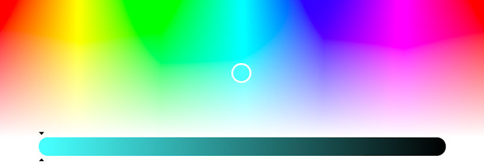
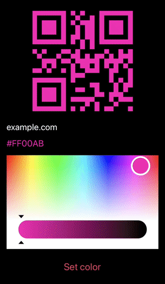

# TelegramColorPicker
Simple telegram style color picker built with Swift & UIKit

<p align="center">  

  
  
  
  
  
  
  
</p>

## Installation

### CocoaPods
[CocoaPods](https://cocoapods.org) is a dependency manager for Cocoa projects. To integrate TelegramColorPicker into your project using CocoaPods, specify it in your `Podfile`:

```ruby
pod 'TelegramColorPicker', '~> 1.3.0'
```
After that use `pod install` command in your terminal.

### Carthage
[Carthage](https://github.com/Carthage/Carthage) is a decentralized dependency manager that builds your dependencies and provides you with binary frameworks. To integrate TelegramColorPicker into your Xcode project using Carthage, specify it in your `Cartfile`:

```ogdl
github "IrelDev/TelegramColorPicker"
```
After that use `carthage update` command in your terminal.

### Swift Package Manager
The [Swift Package Manager](https://swift.org/package-manager/) is a tool for automating the distribution of Swift code and is integrated into the `swift` compiler. To integrate TelegramColorPicker into your Xcode project using Swift Package Manager, specify it in you `Package`:

dependencies: [
    .package(url: "https://github.com/IrelDev/TelegramColorPicker.git", .upToNextMajor(from: "1.3.0"))
]

### Manually
If you prefer not to use any dependency managers, you can integrate TelegramColorPicker into your project manually by downloading the desired release and copying the `Sources` directory.

***
**Warning**

Sources downloaded directly from the master branch may be unstable, please download sources from [releases](https://github.com/IrelDev/TelegramColorPicker/releases) page.
***

## Usage

### Programmatically
Create `TelegramColorPicker` instance then add it as a subview.
```swift
let frame = CGRect(x: .zero, y: .zero, width: 400, height: 250)
let colorPicker = TelegramColorPicker(frame: frame)
view.addSubview(colorPicker)
```
### Storyboard
Drag `UIView` object from the object library and set `TelegramColorPicker` as a custom class in identity inspector.
Create and connect @IBOutlet with `TelegramColorPicker` type.

### SwiftUI
Create struct that conforms to `UIViewRepresentable` protocol:
```swift
struct TelegramColorPickerRepresentable: UIViewRepresentable {
    func makeUIView(context: Context) -> TelegramColorPicker {
        TelegramColorPicker()
    }
    func updateUIView(_ uiView: TelegramColorPicker, context: Context) { }
}
```
use it in your `View`:
```swift
var body: some View {
        TelegramColorPickerRepresentable()
        .frame(width: 400, height: 250, alignment: .center)
}
```

### Get color update
Use `getColorUpdate` function with your custom closure and don't forget to use `[weak self]` to avoid strong reference cycle.
```swift
getColorUpdate { [weak self] (_, color) in
           guard let newColor = color.newValue, let hexadecimalColor = newColor.toHex() else { return }
           self?.textLabel.text = hexadecimalColor
}
```
## Example
This repository contains example where you can [see how](Example/QRCodeViewController.swift) TelegramColorPicker can be used for QRCode foreground color changing.

<p align="center">  

</p>

## License
TelegramColorPicker is available under the MIT license, see the [LICENSE](LICENSE) file for more information.
